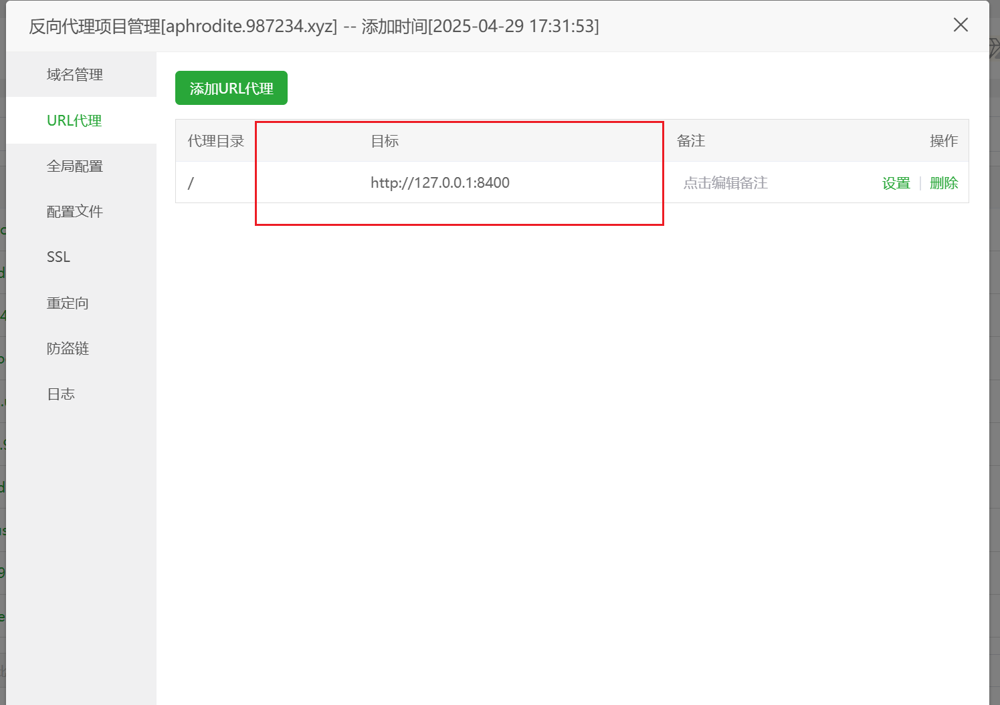

# 4o-image-web-deploy 🖼️


## 📝 项目介绍

free-4o-image-web-deploy 是一个基于 OAI 生图 API 开发的专业图片创作平台，可用于个人小范围网站使用。系统兼容 OAPI 生图格式的中转服务和直连服务。

## ✨ 功能列表

| 功能 | 状态 | 描述 |
|------|------|------|
| 👤 登录注册 | ✅ | 用户账号系统 |
| 🎨 文生图/图生图 | ✅ | AI 图像生成功能 |
| 🖼️ 我的作品 | ✅ | 用户创作管理 |
| 👥 用户管理 | ✅ | 后台用户控制 |
| 📢 公告管理 | ✅ | 系统通知功能 |
| 📝 绘图记录 | ✅ | 用户绘图历史记录管理 |


## 🌐 演示站点

| 类型 | 地址 | 凭据 |
|------|------|------|
| 🖼️ 前台演示 | [https://free-aphrodite.987234.xyz](https://free-aphrodite.987234.xyz) | 账号: `admin`<br>密码: `123456` |
| ⚙️ 后台管理 | [https://free-aphrodite.987234.xyz/#/backend](https://free-aphrodite.987234.xyz/paint/#/backend) | 同上 |
## 🛠️ 技术栈

### 后端
- Java SpringBoot 3
- MySQL
- Redis

### 前端
- Vue 3
- Element Plus
- 绘图页面采用纯原生 HTML

## 📦 快速安装

### 执行脚本
```bash
curl -sSfL https://raw.githubusercontent.com/xiaomifengD/free-4o-image-web-deploy/refs/heads/main/quick-install.sh | bash
```

### 新建nginx 反代
### Nginx 配置说明

安装完成后，请在 Nginx 中添加反向代理配置，指向 `http://127.0.0.1:8400`  
(注意：如果您在 docker-compose.yml 中修改了映射端口，请相应调整此处配置)



### 访问信息
- 🌐 前台访问：`https://您的域名/`
- 🔧 管理后台：`https://您的域名/#/backend`

## ⚠️ 授权说明

免费使用，但是不开源。最多可以添加30个用户，想要商业版可以看看[这个](https://github.com/xiaomifengD/4o-image-web-deploy)

## 📞 联系方式

<table>
  <tr>
    <td></td>
    <td></td>
  </tr>
</table>